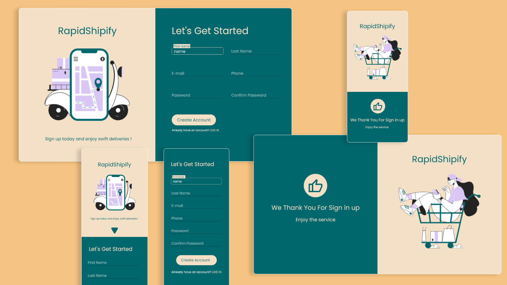

#This is a signUp page for a made up company as an assigment from theOdinProject
<!--favicon-->

  

<h3 align="center"><b>Sign-up Form</b></h3>

  

    For a made up company, RapidShipify
     
     
    <a href="#">View Demo</a>
  

 

<!-- ABOUT THE PROJECT -->
## Preview

 

 

## Built With

-    
-    
- 

 

## Tools Used

-    
-   
-  
 

<!-- ACKNOWLEDGMENTS -->
## Acknowledgments

* Inspiration by [The Odin Project](https://www.theodinproject.com/)
* Structure inspiration by [0xabdulkhalid](https://www.github.com/0xabdulkhalid/basket-sign-up/)
* Illustrative vectors was provided by [Icons8](https://icons8.com/illustrations)

 

<!-- LICENSE -->
## License

- Distributed under the MIT License. See `LICENSE` for more information.

 

<!-- CONTACT -->
## Author

